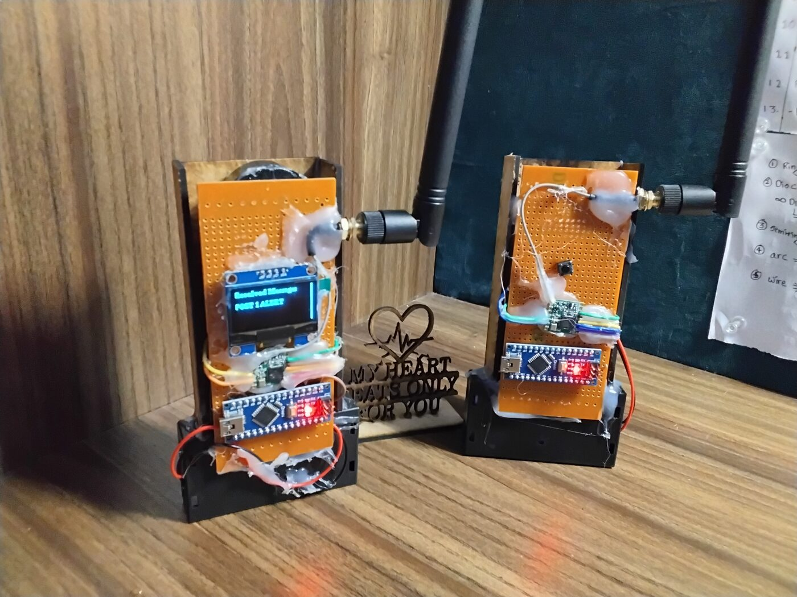

# LoRa Panic Alert System — Build Log

> **This is a photo and hardware-notes archive, not a working codebase.**
> No firmware is included. Pin/wiring info was transcribed from source files used during development and has not been independently re-verified. Treat these as unverified personal notes — not instructions or a deployable system.

A long-range wireless panic-button / alert system built as a hobby project using battery-powered button posts, LoRa relays, and an ESP32 base station with an OLED display and WiFi configuration portal for naming nodes.

More photos: [`docs/gallery.md`](docs/gallery.md)

<!-- TODO: Replace with GitHub user-attachment URL after uploading the video -->

Demo video: [`docs/videos/demo.mp4`](docs/videos/demo.mp4)

## What's Here

* [`docs/gallery.md`](docs/gallery.md) — build photos
* [`docs/videos/demo.mp4`](docs/videos/demo.mp4) — demo video
* [`docs/wiring.md`](docs/wiring.md) — pinout notes by node role

## Hardware

| Part                             | Notes                 |
| -------------------------------- | --------------------- |
| Arduino Nano (ATmega328)         | Transmitter, Relay    |
| ESP32 dev board                  | Central               |
| RFM95W (SX1276) LoRa module      | 915 MHz, one per node |
| 0.96" SSD1306 OLED (I2C, 128×64) | Central only          |
| Piezo / sharp buzzer             | All nodes             |
| Momentary push button            | Transmitter           |
| Status LED                       | Relay, Transmitter    |
| 18650 battery holder             | Per node              |
| Whip antenna (SMA)               | Per node              |

## License

MIT — see [LICENSE](LICENSE).
