# Build Gallery

## Central node

| | |
|---|---|
| 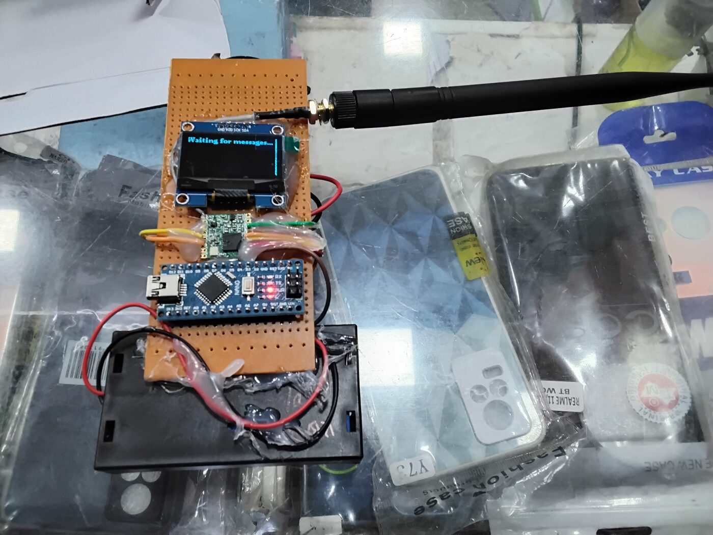 |  |
| Idle screen | Two Central units, one showing a received alert |
| 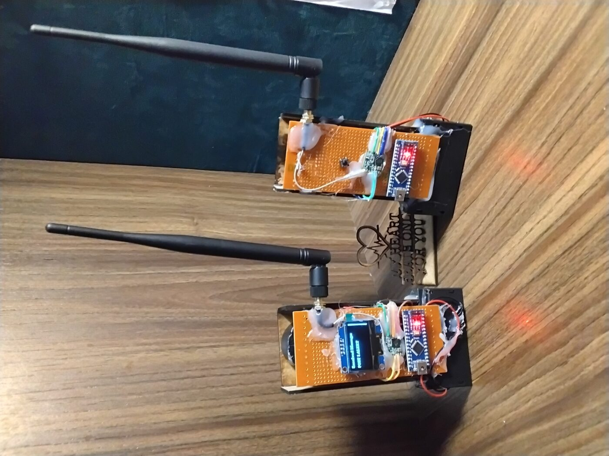 | 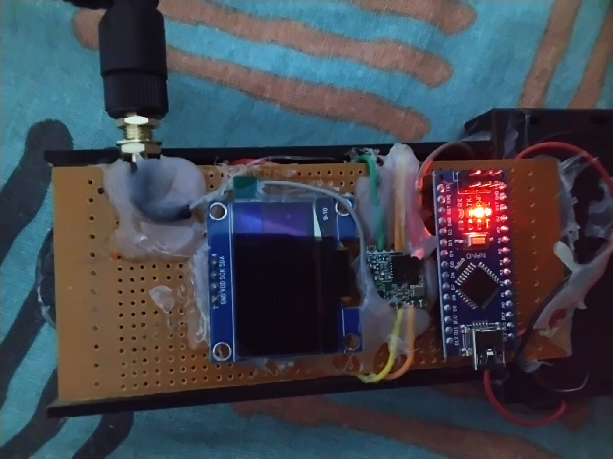 |
| Standing pair on a shelf | Top-down view of an assembled unit |

## Transmitter / Relay boards

| | |
|---|---|
| 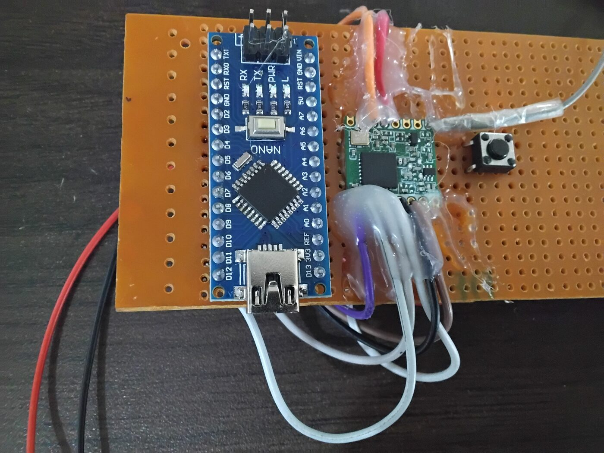 | 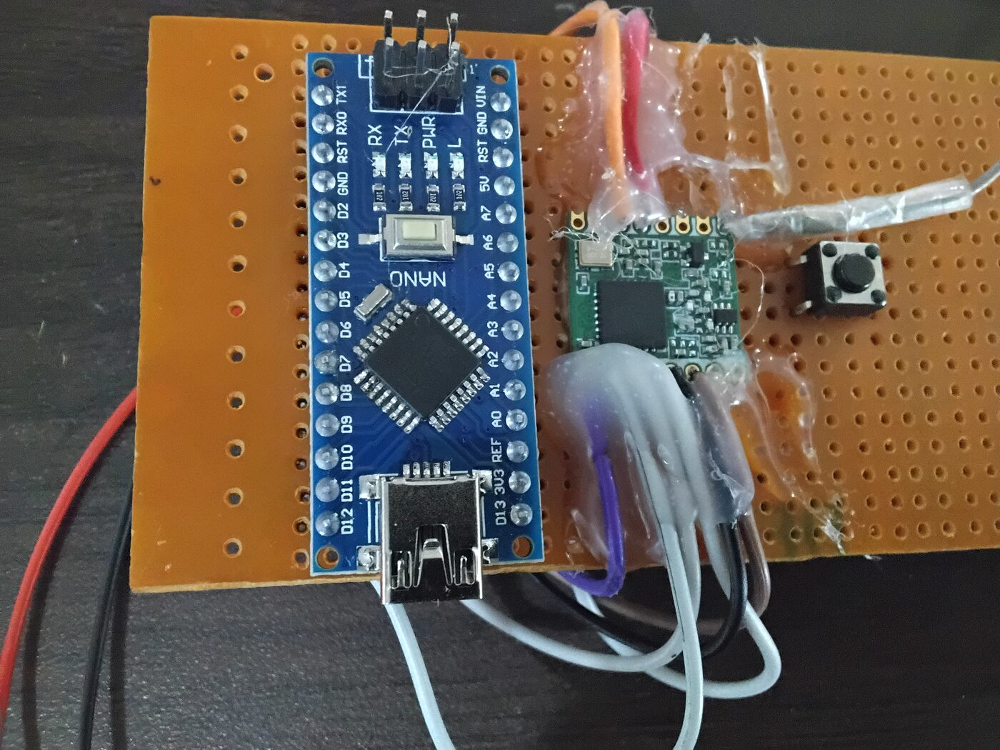 |
| Nano + RFM95 + button, bare board | Same layout, second unit |
| 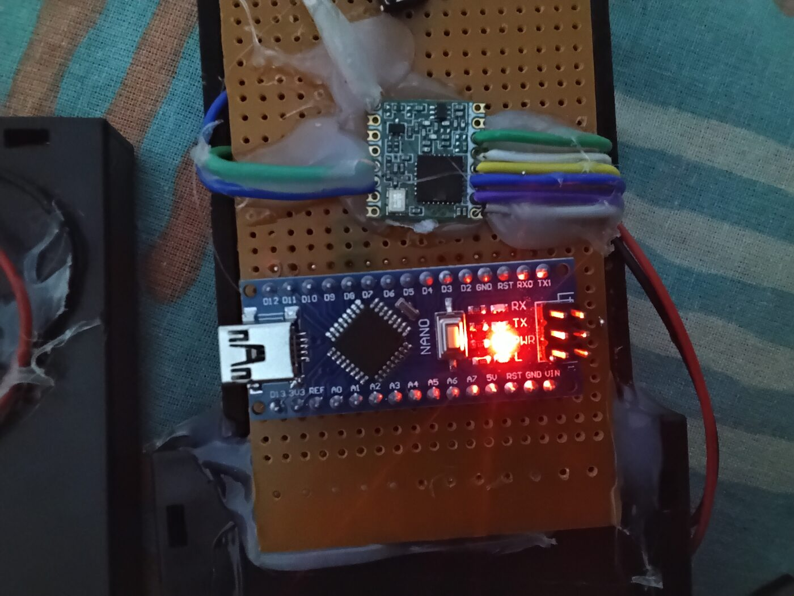 | |
| RFM95 module wiring detail | |

## Prototyping / bench shots

| | |
|---|---|
| 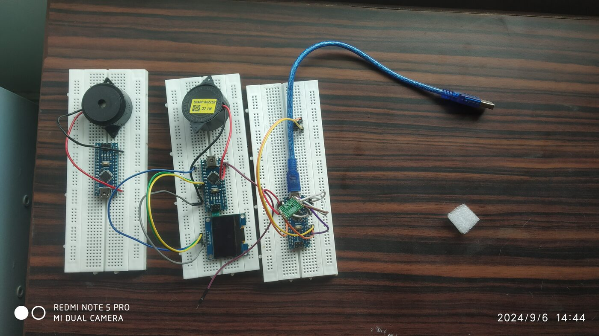 | 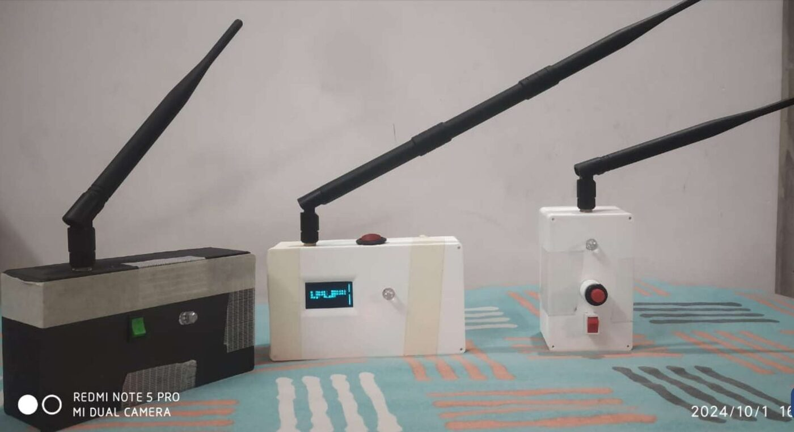 |
| Early breadboard stage — buzzer, OLED, Nano | Three finished enclosures side by side |
| 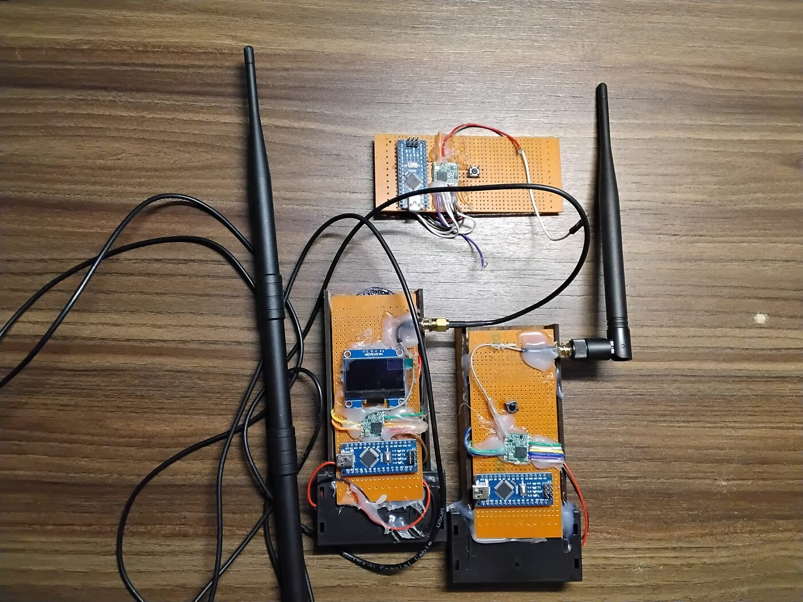 | 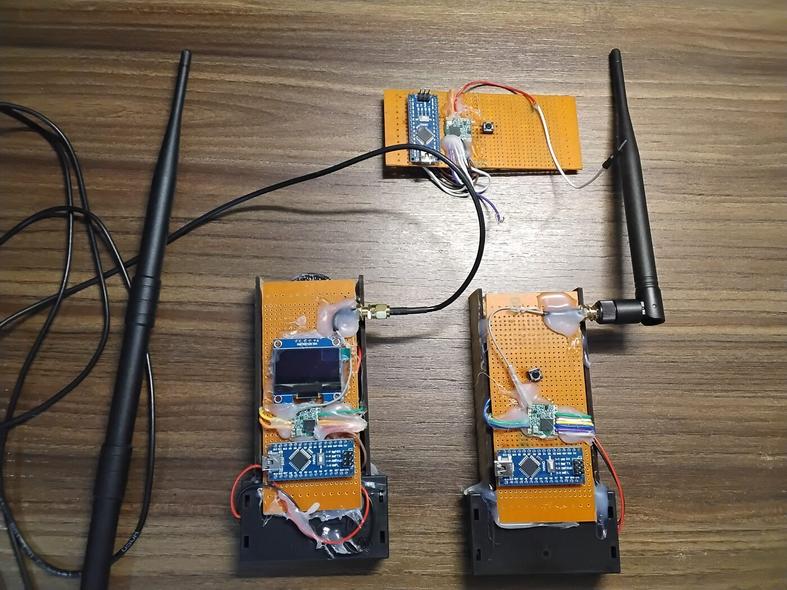 |
| Multiple boards wired on the bench | Overhead shot of three separate assemblies |
| 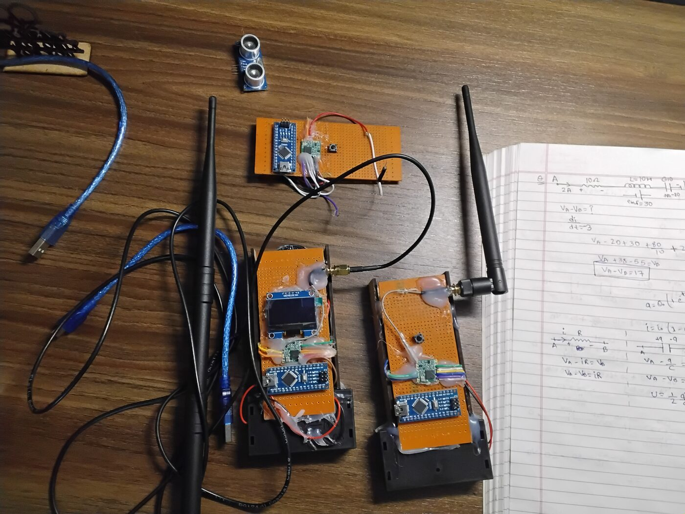 | |
| Bench setup next to circuit-theory notes | |
